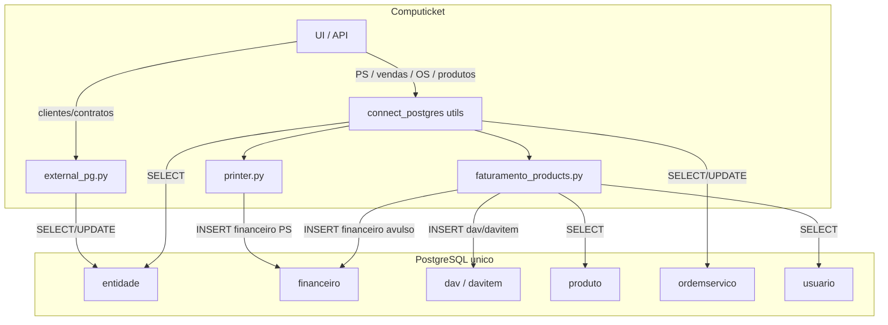

# Banco PostgreSQL `unico` — mapa de consultas e inserções

Documentação do uso do ERP **Unico** (PostgreSQL externo) pelo Computicket.

> **Não confundir** com o Postgres do app (`computicket` no Docker **host :15432** / interno `:5432`) nem com o do WhatsApp (`computicket_whatsapp`). O Uniplus/ERP fica na **5432 do host** (ou servidor Uniplus).

---

## Integração via agente (recomendado)

Com o **agente habilitado** (Configurações → Uniplus, ou `UNIPLUS_AGENT_ENABLED=1`), as **escritas** no Unico não saem mais direto da API: são enfileiradas em `uniplus_job` e executadas pelo agente local em [`agents/uniplus_agent/`](../agents/uniplus_agent/).

```
Computicket API  --Socket.IO /uniplus-->  Agente (servidor Unico)  -->  Postgres unico
                 <-- ack done/error ----
```

| Peça | Onde |
|------|------|
| Fila / wait | [`api/app/app/uniplus_jobs.py`](../api/app/app/uniplus_jobs.py) |
| WS namespace | [`api/app/app/blueprints/uniplus_agent_ws.py`](../api/app/app/blueprints/uniplus_agent_ws.py) |
| Status / config | `GET/PUT /api/uniplus/config` · `GET /api/uniplus/status` |
| UI | Configurações → aba **Uniplus** |
| Agente | [`agents/uniplus_agent/README.md`](../agents/uniplus_agent/README.md) |

Prioridade de config do **agente**: **SystemConfig** (`uniplus_agent_*`) → variáveis de ambiente → desligado.

Config do **Postgres Unico (leituras da API)** fica só em SystemConfig (`uniplus_pg_*`). Rebuild de imagem Docker **não** apaga isso; só some se o volume Postgres for removido (`docker compose down -v`) ou se uma migração antiga com `--wipe` truncar `system_config` (hoje preservada).

**SELECTs** (listar clientes, produtos, OS, etc.) e o fallback legado usam
`connect_postgres()` / `external_pg`, com host e credenciais em **SystemConfig**
(`uniplus_pg_*`, Configurações → Uniplus). Não há `UNICO_PG_*` no `.env`.

Com o agente desabilitado (default), as escritas usam o caminho legado abaixo.

---

## Conexão (leituras / legado)

Uma única fonte de verdade: **Configurações → Uniplus → Postgres Unico (API)**.

| Chave SystemConfig | Default | Uso |
|--------------------|---------|-----|
| `uniplus_pg_host` | *(vazio)* | Host alcançável pela API |
| `uniplus_pg_port` | `5432` | Porta |
| `uniplus_pg_database` | `unico` | Database |
| `uniplus_pg_user` | *(vazio)* | Usuário |
| `uniplus_pg_password` | *(vazio)* | Senha |
| `uniplus_pg_connect_timeout` | `5` | Timeout (s) |

| Módulo | Função |
|--------|--------|
| [`app/external_pg.py`](../api/app/app/external_pg.py) | Clientes / contratos (`entidade`) |
| [`app/blueprints/utils.py`](../api/app/app/blueprints/utils.py) → `connect_postgres()` | Faturamento, OS, produtos, DAV |

O Postgres **local do agente** (em geral `127.0.0.1`) continua só na UI do agente no servidor Unico — não é essa config.

---

## Tabelas usadas no `unico`

| Tabela | Uso no Computicket |
|--------|--------------------|
| `entidade` | Clientes (e representantes). Campos extras: `extra9` (contrato principal), `extra10` (sem cobrança), `extra11` (contratos adicionais CSV), `observacao` |
| `financeiro` | Títulos a receber (PS / venda avulsa / fora de estoque) |
| `dav` | Pedido de faturamento (produtos) |
| `davitem` | Itens do DAV |
| `produto` (+ estoque via join) | Catálogo / validação de produtos |
| `usuario` | Mapeamento técnico local → usuário/representante no Unico |
| `ordemservico` | Ordens de serviço do Unico (busca + finalização) |

> SQL Server `Chamado.servicos` (via `connect_sql_server`) **não** é o Unico; entra só no fluxo de PS em paralelo.

---

## 1. Camada `external_pg` — clientes e contratos

Tudo gira em torno de **`entidade`**.  
**Não há INSERT de cliente** no Unico pelo Computicket — só `SELECT` e `UPDATE`.

### 1.1 Consultas (SELECT)

| Função | SQL resumido | Quem chama |
|--------|--------------|------------|
| `fetch_external_clients()` | `SELECT id, nome, cnpjcpf, celular, email, endereco, numeroendereco, extra9, extra10, observacao FROM entidade WHERE inativo = 0` | tickets, clients, contracts, budget, agenda, password_vault, web_api, scheduler |
| `fetch_external_clients_search(q)` | Idem + `ILIKE` em nome/doc/fone/email/endereço/contrato | clients, web_api |
| `get_client_by_email(email)` | `WHERE LOWER(email) = LOWER(%s)` | (API / helpdesk) |
| `fetch_contract_types()` | `SELECT DISTINCT extra9 FROM entidade WHERE inativo = 0 AND extra9 <> ''` | contracts, clients, web_api |
| `fetch_clients_by_contract_type(name)` | `WHERE extra9 = %s` | contracts / helpers |
| `search_all_clients(term)` | Lista geral com `ILIKE`, limit 50 | `contracts.search_clients_for_contract_creation` |
| `search_clients_not_in_contract(contract, term)` | Clientes fora do contrato (`extra9`/`extra11`) | `contracts.search_clients_for_contract` |
| `get_clients_by_contract(name)` | `extra9 = name OR extra11 LIKE %name%` | contracts (tela gerenciar) |
| `get_contracts_with_services()` | Tipos Unico + join SQLite/Postgres app `contract_service` | contracts, web_api |
| `get_services_for_contract(name)` | Só app DB (`contract_service`) | contracts |
| `client_has_contract_for_service(client_id, service_id)` | Lê `extra9`/`extra11` no Unico + checa `contract_service` no app | tickets (cobrança / contrato) |

### 1.2 Escritas (`entidade`)

| Função | O que grava | Quem chama |
|--------|-------------|------------|
| `create_external_client(...)` | `INSERT` cliente (`cliente=1`, `tipopessoa` PF/PJ, contato, endereço, `codigo` sequencial) | `POST /api/web/clients` |
| `update_external_client(...)` | `nome, cnpjcpf, celular, email, endereco, numeroendereco, observacao` (+ opcional `extra10`) | `clients.edit` / `web_api` update cliente |
| `assign_contract_to_clients(name, ids, no_charge?)` | `extra9` (+ `extra10`) em lote | contracts (fluxo legado) |
| `update_contract_type(old, new, no_charge?)` | Renomeia `extra9` / ajusta `extra10` | `contracts` editar contrato |
| `add_clients_to_contract(name, ids)` | `UPDATE extra9 = name WHERE id = ANY(...)` | contracts |
| `remove_contract_from_all_clients(name)` | `extra9/extra10 = NULL` onde `extra9 = name` | `contracts` excluir contrato |
| `add_client_to_contract(client_id, name)` | Se sem contrato → `extra9`; senão acrescenta em `extra11` (CSV) | `contracts` criar / adicionar cliente |
| `remove_client_from_contract(client_id)` | Zera `extra9` e `extra11` do cliente | (helper) |
| `remove_client_from_contract(client_id, name)` | Remove contrato específico de `extra9` ou `extra11` | `contracts.remove_client_from_contract_route` |

#### Semântica dos campos extras

```
extra9  = contrato principal (texto livre, ex.: "MENSAL OURO")
extra10 = flag "sem cobrança" (0/1)
extra11 = contratos adicionais separados por vírgula
```

#### Fluxo típico de escrita (contratos)

```
UI /contratos
  → contracts.add_clients_to_contract_route / create
  → external_pg.add_client_to_contract(client_id, contract_name)
  → UPDATE entidade SET extra9 = ... OR extra11 = ...
```

#### Fluxo típico de edição de cliente

```
UI /clientes (edit)
  → clients.update → update_external_client(...)
  → UPDATE entidade SET nome, cnpjcpf, celular, email, endereco, ...
```

---

## 2. Camada `connect_postgres()` — faturamento / OS / produtos

Arquivos centrais:

- [`blueprints/utils.py`](../api/app/app/blueprints/utils.py) — conexão
- [`blueprints/printer.py`](../api/app/app/blueprints/printer.py) — PS → `financeiro`
- [`services/faturamento_products.py`](../api/app/app/services/faturamento_products.py) — produtos, DAV, venda avulsa
- [`blueprints/tickets.py`](../api/app/app/blueprints/tickets.py) — fechamento ticket, vendas avulsas, cancelamentos
- [`blueprints/service_orders.py`](../api/app/app/blueprints/service_orders.py) — OS Unico

### 2.1 Consultas

| Função / rota | Tabela(s) | Descrição |
|---------------|-----------|-----------|
| `get_id_entity(cnpj)` | `entidade` | Resolve CNPJ/CPF → `id` |
| `check_duplicate_finance_pg(doc)` | `financeiro` | `COUNT(*) WHERE documento = %s` |
| `search_products` / listagens em faturamento | `produto` + estoque | Catálogo para modal de produtos |
| `validate_products(cursor, produtos)` | `produto` | Confere id/estoque/preço antes de DAV |
| `get_external_user_data(cursor, user)` | `usuario`, `entidade` | Mapeia técnico local → `idusuario` / `identidade` representante |
| `check_dav_duplicate(...)` | `dav` | `observacao ILIKE '%Ticket: 123%'` |
| `_search_service_orders` | `ordemservico` ⋈ `entidade` | OS abertas por código/nome |
| `api_vendas_avulsas_list` | `financeiro` ⋈ `entidade` | Lista vendas avulsas (`observacaoboleto='Avulso'`, `idcodigocontabil=71`) |
| `api_venda_avulsa_imprimir` | `financeiro` ⋈ `entidade` | Dados para PDF duplicata |
| Cancelamento de PS (ticket) | `financeiro` | `SELECT/DELETE WHERE documento = ps_number` |
| printer (lookup cliente) | `entidade` | Mesmos campos de cliente por id |

### 2.2 Inserções e updates

#### A) Prestação de serviço (PS) → `financeiro`

**Função:** `insert_finance_pg(id_entidade, document, title, description_service, total)`  
**Arquivo:** `printer.py`

```sql
INSERT INTO financeiro (
  idfilial, identidade, tipo, documento, idtipodocumentofinanceiro,
  status, emissao, vencimento, valor, saldo,
  historico, idcodigocontabil, observacaoboleto
) VALUES (
  1, :id_entidade, 'R', :documento, 8,
  'A', :hoje, :amanha, :valor, :valor,
  :historico, 192, 'Avulso'
);
```

**Chamadas:**

1. `print_ps` (rota `/printers` POST)  
   → `get_id_entity(cnpj)`  
   → `insert_service_sqlserver(...)` (SQL Server)  
   → `insert_finance_pg(...)` (Unico)

2. Fluxo preferencial com controle de transação:  
   `insert_ps_with_transaction_control(...)`  
   - INSERT SQL Server `servicos`  
   - INSERT Unico `financeiro` com `documento = 'PS/' + CODIGO`  
   - commit nos dois  

   Chamado por:
   - `printer.print_ps` (quando usa o fluxo unificado)
   - `service_orders` ao finalizar OS com cobrança (gera PS)

```
POST /printers  (ou finalização de OS)
  → get_id_entity(cnpj)                    -- SELECT entidade
  → insert_ps_with_transaction_control(...)
       ├─ INSERT servicos (SQL Server)
       └─ INSERT financeiro (unico)
```

#### B) DAV (pedido de faturamento de produtos)

**Função:** `create_dav(cursor, client_id=..., reference_label=..., reference_code=..., product_details=..., local_user=...)`  
**Arquivo:** `faturamento_products.py`

```sql
INSERT INTO dav (
  idfilial, tipodocumento, idcliente, status, valor, data,
  idcondicaopagamento, observacao, idusuario, titulodav, tipofrete,
  codigo, idrepresentante
) VALUES (...) RETURNING id, codigo;

INSERT INTO davitem (
  iddav, contador, preco, quantidade, idproduto, total,
  precooriginal, nomeproduto, codigodav
) VALUES (...);
```

**Chamadas:**

| Origem | Rota / função | `reference_label` |
|--------|---------------|-------------------|
| Fechar ticket com produtos | `tickets.process_ticket_close` → `POST /tickets/<id>/processar-fechamento` | `"Ticket"` |
| Finalizar OS Unico com produtos | `service_orders` finalize | `"OS"` |

```
POST /tickets/<id>/processar-fechamento
  → connect_postgres()
  → validate_products(cursor, produtos)     -- SELECT produto
  → create_dav(cursor, client_id=external_client_id, "Ticket", ticket.id, ...)
       ├─ INSERT dav
       └─ INSERT davitem (N linhas)
  → commit
  → grava dav_id/dav_codigo no ticket (banco do app)
```

#### C) Venda avulsa / produto fora de estoque → `financeiro`

**Função:** `create_out_of_stock_finance_record(cursor, client_id, product_name, quantity, unit_price, idrepresentante=...)`  

```sql
INSERT INTO financeiro (
  idfilial, identidade, tipo, documento, idtipodocumentofinanceiro,
  status, emissao, vencimento,
  valor, saldo, historico, idcodigocontabil, observacaoboleto, idrepresentante
) VALUES (
  1, :client_id, 'R', :documento, 8,
  'A', :hoje, :amanha,
  :total, :total, :historico, 71, 'Avulso', :rep_id
) RETURNING id;
```

Diferença da PS: `idcodigocontabil = 71` (venda avulsa) vs `192` (PS).

**Chamada principal:**

```
POST /tickets/api/produto-fora-estoque-direto
  → get_external_user_data(cursor, seller)   -- SELECT usuario/entidade
  → create_out_of_stock_finance_record(...)  -- INSERT financeiro (por item)
  → commit
```

Também usada internamente em helpers de faturamento (`faturamento_products.py`).

#### D) Cancelar venda avulsa → `UPDATE financeiro`

```
POST /tickets/api/vendas-avulsas/<id>/cancel
  → UPDATE financeiro
       SET status = 'C',
           devolucaodescricao = :reason,
           devolucaocodigo = 1,
           devolucaodata = :hoje
     WHERE id = :sale_id
       AND observacaoboleto = 'Avulso'
       AND idcodigocontabil = 71
```

#### E) Cancelar PS → `DELETE financeiro` (+ SQL Server)

No cancelamento de PS do ticket:

```
SELECT * FROM financeiro WHERE documento = :ps_number
DELETE FROM financeiro WHERE documento = :ps_number
```

(e espelho em SQL Server `servicos`).

#### F) Finalizar ordem de serviço Unico → `UPDATE ordemservico` (+ DAV opcional)

```
service_orders.finalize (rota de finalização)
  → connect_postgres()
  → validate_products / create_dav (se houver produtos)
  → UPDATE ordemservico SET
        servicoexecutado, valor, status (3=sem cobrança / 5=com cobrança),
        fimservico, geroufinanceiro, impresso, ...
      WHERE codigo = :codigo
  → commit
  → se com cobrança: insert_ps_with_transaction_control(...)  -- financeiro + SQL Server
```

---

## 3. Diagrama resumido



---

## 4. O que **não** é escrito no Unico

- Tabelas do app (tickets, users, budgets…) — ficam no SQLite/Postgres `computicket`
- Vínculo contrato↔serviço (`contract_service`) — banco do **app**, não do Unico
- Detalhes de contrato por cliente (`client_contract`) — banco do **app**

Cadastro de nova `entidade` (cliente) existe via `create_external_client` / job `create_client` (tela Clientes → Novo cliente).

---

## 5. Checklist rápido “quem escreve o quê”

| Operação no Unico | Função | Entry point HTTP / fluxo |
|-------------------|--------|---------------------------|
| Criar cliente | `create_external_client` | `POST /api/web/clients` |
| Atualizar dados do cliente | `update_external_client` | `/clientes` edit, web_api |
| Atribuir/remover contrato (`extra9`/`extra11`) | `add_client_to_contract`, `remove_client_from_contract`, `update_contract_type`, … | `/contratos/*` |
| Inserir título PS | `insert_finance_pg` / `insert_ps_with_transaction_control` | `POST /printers`, finalização OS |
| Inserir DAV + itens | `create_dav` | `POST .../processar-fechamento`, finalizar OS com produtos |
| Inserir venda avulsa | `create_out_of_stock_finance_record` | `POST /tickets/api/produto-fora-estoque-direto` |
| Cancelar venda avulsa | `UPDATE financeiro` | `POST /tickets/api/vendas-avulsas/<id>/cancel` |
| Cancelar PS | `DELETE financeiro` | cancelamento de PS no ticket |
| Finalizar OS Unico | `UPDATE ordemservico` | finalização em `/ordens-servico` |

---

## 6. Observações

1. Host/credenciais do Postgres Unico ficam em SystemConfig (`uniplus_pg_*`, Configurações → Uniplus) — sem `.env`.
2. Inserts em `financeiro` usam `observacaoboleto = 'Avulso'` tanto para PS (`idcodigocontabil=192`) quanto venda avulsa (`71`) — filtros de listagem separam pelo código contábil e pelo prefixo do `documento` (`PS%` / `NFSe%`).
3. Transações DAV/OS usam `conn.autocommit = False` + `commit`/`rollback` explícitos.
4. PS tenta consistência com SQL Server; se um lado falha, há rollback (melhor esforço, não é 2PC).
